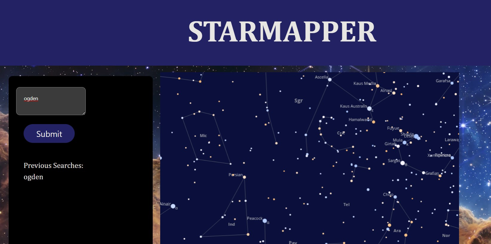

# Starmapper
​
## Description
​
Provide a short description explaining the what, why, and how of your project. Use the following questions as a guide:
​
- What was your motivation?
- Our motivation for this project was we wanted to know what constellations are above me in the sky, as well as how to use web api calls and encorporate them into a webpage.
- We built this project to create a fun website people can go to, input their city, and get back a constellation and what it looks like in the sky. We wanted practice with web API calls
- The problem it solves is we have a lot of light pollution in this day and age, this webpage allows us to see constellations as well as see what stars are around them, you could do this for fun or to learn more about star maps
- We learned how to do API fetch calls (experimenting with APIs that have no instruction), how to work together in a group and make sure we are all actively participating and learning at the same time. We learned how to work on a github repository together and make sure we werent overriding other peoples work. 

​
## Usage
​
Open up the webpage [webpage here](https://newtron21.github.io/Starmapper) and input your city/ address, click submit. Wait for server to return a constellation sky map. VOILA! you have a constellation image!

​Here is a screenshot of what the page looks like 

​
## Credits

[Jeremy Rapich](https://github.com/jrapich)

[Elizabeth Hawkins](https://github.com/elihawkins123/)

[Anna Newton](https://github.com/Newtron21/)

[Jacob Maughan](https://github.com/jacslimob)

[Mapquest API](https://developer.mapquest.com/documentation/geocoding-api/address/get/)

[Astronomy API](https://docs.astronomyapi.com/endpoints/studio/star-chart)

​

​
## License
MIT License

Copyright (c) [2023] [Anna Newton, Jeremy Rapich, Elizabeth Hawkins, Jacob Maughan]

Permission is hereby granted, free of charge, to any person obtaining a copy of this software and associated documentation files (the "Software"), to deal in the Software without restriction, including without limitation the rights to use, copy, modify, merge, publish, distribute, sublicense, and/or sell copies of the Software, and to permit persons to whom the Software is furnished to do so, subject to the following conditions:

The above copyright notice and this permission notice shall be included in all copies or substantial portions of the Software.

THE SOFTWARE IS PROVIDED "AS IS", WITHOUT WARRANTY OF ANY KIND, EXPRESS OR IMPLIED, INCLUDING BUT NOT LIMITED TO THE WARRANTIES OF MERCHANTABILITY, FITNESS FOR A PARTICULAR PURPOSE AND NONINFRINGEMENT. IN NO EVENT SHALL THE AUTHORS OR COPYRIGHT HOLDERS BE LIABLE FOR ANY CLAIM, DAMAGES OR OTHER LIABILITY, WHETHER IN AN ACTION OF CONTRACT, TORT OR OTHERWISE, ARISING FROM, OUT OF OR IN CONNECTION WITH THE SOFTWARE OR THE USE OR OTHER DEALINGS IN THE SOFTWARE.
​
---
​
🏆 The previous sections are the bare minimum, and your project will ultimately determine the content of this document. You might also want to consider adding the following sections.
​
